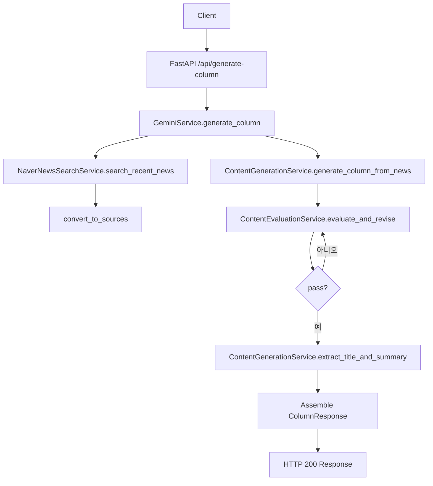
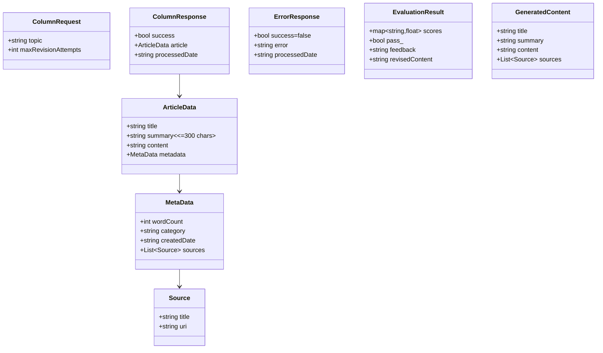

## 시스템 개요 및 데이터 구조

이 문서는 AI 정치 컬럼니스트 시스템의 요청 흐름과 핵심 데이터 모델을 시각화합니다.

### 시스템 플로우 (Request → Response)

핵심 흐름 요약
- 뉴스 수집: `NaverNewsSearchService.search_recent_news(topic)` → 관련성/최신성 필터
- 컬럼 생성: `ContentGenerationService.generate_column_from_news(topic, news_data)`
- 품질 평가/수정 반복: `ContentEvaluationService.evaluate_and_revise(content)` 루프
- 제목/요약 추출: `extract_title_and_summary(content)` (요약 ≤ 300자 가드)
- 응답 조립: `ColumnResponse`로 변환(CamelCase), `MetaData.sources` 정규화

### 데이터 모델 (schemas.py)

### 다이어그램 보기 방법
- GitHub: 이 Markdown 파일은 GitHub에서 Mermaid를 자동 렌더링합니다.
- VS Code: "Markdown Preview Enhanced" 또는 "Mermaid Markdown Syntax Highlighting" 확장 설치 후 미리보기(⌘K V).
- CLI(선택): `@mermaid-js/mermaid-cli`(mmdc)로 PNG/SVG 내보내기.

### 변경 시 주의사항
- 요약(summary)은 300자 이내를 유지해야 합니다. 시스템은 로직/프롬프트/API 레이어에서 모두 가드합니다.
- `MetaData.sources`는 `{ title, uri }` 구조의 리스트를 유지하세요.

